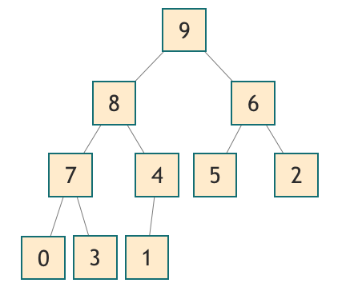
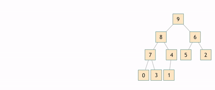
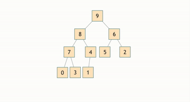
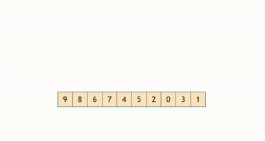

<h1 align="center">Trabalho de Aquecimento: Top K Elementos</h1>

<p style="font-size:120%;" align="center">
    <a href="#problema">Problema</a> -
    <a href="#desenvolvimento">Desenvolvimento</a> -
    <a href="#resultados">Resultados</a> -
    <a href="#conclusao">Conclusao</a> -
    <a href="#executar">Executar</a> -
    <a href="#contatos">Contatos</a>
</p>

# Problema

Um exemplo clássico de problema que pode ser solucionado utilizando-se hash e heap é o
chamado top k itens. Neste problema, é preciso encontrar os k itens mais valiosos de uma
coleção de dados. Logo, utiliza-se o hash para contar a frequência de todos os itens, enquanto
o heap se aplica na manutenção de uma lista dos k itens de maior valor. Sabendo-se disso,
elabore uma solução em C/C++ que dado uma entrada:
• Crie uma tabela de dispersão (hash) para contar a frequência de cada elemento tokenizado da coleção de dados de entrada.
• Crie uma árvore de prioridades (heap) de tamanho k e insira os primeiros k elementos do
hash nela.

1. - Para cada elemento restante na hash, compare a contagem com o menor valor do
     heap.

2. - Se a contagem for maior do que o menor valor da heap, remova o menor valor, insira
     o novo elemento e refaça a estrutura.

3. - Caso contrário, ignore o elemento e vá para o próximo

• No final, a heap conterá os k elementos com maiores valores (frequências) da coleção
de dados. Então, imprima-os em ordem crescente.
Esse algoritmo é uma combinação eficiente do uso de hash para contar a frequência dos
elementos e heap para manter a lista dos k elementos com maiores valores. Sua complexidade,
caso implementado adequadamente, é de O(nlogk), onde n é o tamanho da coleção de dados
e k o número de itens mais relevantes.

# Desenvolvimento

## O problema foi desenvolvido da seguinte maneira:

A solução proposta é baseada em um programa C++ que tem como objetivo principal analisar um arquivo de texto, considerando vários parâmetros. O arquivo de entrada é um arquivo .txt com uma estrutura específica, onde cada sentença termina com um sinal de pontuação e cada parágrafo é separado por pelo menos uma linha em branco.

A base da hash é a mesma do ultimo trabahlo que tivemos em AEDS 1 link do respositorio

São definidas as classes e estruturas de dados utilizadas no programa, como a classe `WordInfo` .

A função `TextCollector` lê um arquivo de texto e retorna um vetor de pares, onde cada par contém o número da linha e o conteúdo da linha. A função `DivideParagrafos` recebe o vetor de pares do arquivo de texto e realiza a divisão em parágrafos, sentenças e palavras, retornando uma estrutura de dados aninhada para representar essa estrutura.

Outras funções implementadas incluem `StopWordExtractor` , que lê arquivos de stopwords, respectivamente, e retornam um conjunto de strings contendo essas palavrass.

A função `TextAnalyzer` é responsável por analisar o texto dividido em parágrafos, sentenças e palavras, utilizando as stopwords e expressões fornecidas. Essa função percorre as estruturas de dados, realiza contagens de palavras, gera relatórios e atualiza informações sobre as ocorrências das expressões.

No geral, a implementação desse código demonstra o uso de estruturas de dados, manipulação de arquivos, processamento de texto e geração de relatórios. O programa é organizado e modularizado, facilitando a compreensão e manutenção do código. A utilização de técnicas como leitura de arquivos, busca em estruturas de dados e manipulação de strings permite a análise do texto e a geração de informações relevantes para o usuário.

## Representação gráfica :camera:

<div align="justify">
	
Foram feitos dois gifs de  representações gráficas onde foi possível representar ideias do código final, a primeira representação abaixo demonstra o funcionamento passo a passo de como é feito o tratamento da e remoção das `stopWords`.

<br><br>

<p align="center">
 
</p>
<p align="center">
<em>Gif 1: Diagama do funcionamento do método de stopwords.</em>
</p>

Foi implementado as seguintes estruturas no trabalho:

Contêineres Associativos:

- Unordered_set -> https://cplusplus.com/reference/unodered_set
- Unordered_map -> https://cplusplus.com/reference/unordered_map/unordered_map/

**unordered_set:** É uma implementação de um conjunto (set) não ordenado usando tabelas hash. Os elementos são armazenados em posições determinadas por suas chaves (hashes). Isso permite que as operações de inserção, remoção e busca tenham uma complexidade média de O(1), em média, tornando-as muito eficientes.

**unordered_map:** É uma implementação de um mapa (map) não ordenado usando tabelas hash. Cada elemento é um par de chave-valor, onde a chave é usada para acessar o valor. Assim como no unordered_set, as operações de inserção, remoção e busca também têm uma complexidade média de O(1), em média.

Contêineres de Sequência:

- Vector -> https://cplusplus.com/reference/vector/vector/

> Todas essas estruturas já estão implementadas como bibliotecas no C++, basta chamá-las.

```cpp
#include <vector>
#include <unordered_set>
#include <unordered_map>
```

## Heap

O maxHeap , metodo utilizado na elaboração do algoritmo é uma árvore binária completa, que é preenchida em todos os níveis, exceto talvez o último nível, que é preenchido da esquerda para a direita.

Podemos inferir algumas coisas da afirmação acima. Em primeiro lugar, os nós da folha da árvore estarão no último nível ou no nível acima dele. Em segundo lugar, em todos os níveis, exceto talvez no último nível, cada nó pai deve ter exatamente dois filhos. E, finalmente, nenhum sibilng direito pode existir sem seu irmão esquerdo.

Propriedade Heap

> O valor do nó pai é sempre maior ou igual ao de seus filhos.

Isso significa que o valor máximo na pilha deve ocorrer no nó da raiz, e o valor mínimo na pilha deve ocorrer em qualquer um dos nós da folha. Observe que a propriedade heap não menciona nenhuma relação entre o irmão esquerdo e direito de um nó. O irmão esquerdo pode ter um valor maior que o irmão direito, ou pode ser o contrário. Desde que cada pai tenha um valor maior do que seus irmãos, a propriedade heap é satisfeita.

### Entendendo melhor o heap

Um heap é uma estrutura de dados útil quando é necessário remover repetidamente o objeto com a prioridade mais alta (ou mais baixa).

<p align="center">
 
</p>
Heaps são uma implementação de Priority Queues.

Uma implementação é fazer uma alocação dinâmica para cada nó, com 2 ponteiros apontando para seus filhos (como uma lista vinculada).

Mas há uma implementação mais eficiente: representá-lo na forma de uma matriz, fazendo uma travessia de ordem de nível do heap.

<p align="center">
 
</p>

Uma boa propriedade das árvores binárias representadas como matrizes é que, para chegar ao filho esquerdo de um nó em um determinado índice i, podemos simplesmente pular para o índice **(i + 1) \* 2 - 1** para chegar ao filho esquerdo, e para o índice **(i + 1) \* 2** para o filho direito.

### Inserção da heap

**Complexidade de Tempo: O(log n)**

Durante a inserção de um novo valor em um heap máximo, é essencial garantir que o valor recém-adicionado suba na estrutura de forma apropriada. Isso é feito comparando o novo valor com o seu pai. Sempre que o novo valor é maior do que seu pai, eles são trocados, permitindo que o valor suba na hierarquia da pilha.

Esse processo de "borbulhar" o novo valor para cima continua até que a propriedade do heap seja restaurada, onde cada pai possui um valor maior ou igual aos seus filhos. A lógica por trás disso é assegurar que o valor máximo permaneça no topo da pilha, que é a característica distintiva de um heap máximo.

A complexidade de tempo da operação de inserção é relativamente eficiente, crescendo logaritmicamente à medida que o tamanho da pilha (n) aumenta. Isso é especialmente benéfico para manter um desempenho geral rápido ao inserir novos elementos em uma estrutura de heap máxima.

<p align="center">
 
</p>

### Remoção no heap

Durante a operação de deleção em um heap máximo, a abordagem começa por trocar o elemento superior com o último elemento da pilha. Isso efetivamente remove o maior valor da estrutura, mas deixa a propriedade do heap temporariamente comprometida.

A segunda etapa envolve o processo de "borbulhar" o último elemento - agora posicionado no topo - para baixo, até que ele encontre sua posição adequada. Essa movimentação ocorre através de comparações com seus filhos. Se o valor do último elemento for menor do que qualquer um de seus filhos, eles são trocados para manter a propriedade do heap.

Esse processo de deleção assegura que, após a remoção do elemento máximo, a hierarquia da pilha seja reestabelecida, mantendo a característica de que o maior valor permanece no topo.

A complexidade de tempo associada à operação de deleção é também logarítmica, garantindo que o desempenho geral do heap máximo seja eficiente, mesmo após a remoção de elementos.

<p align="center">
 
</p>

### Inserção dos dados:

Foi criado os arquivos **heap.hpp** para armazenar as funções que irão pegar os dados armazenados nos arquivos tratados na **hash.cpp** e irão armazena-los nas estruturas de dados.

```cpp
void HeapMAX::inserir(const DataPair &pair) {
   heap.push_back(pair);
   int index = heap.size() - 1;
   while (index > 0) {
       int parentIndex = (index - 1) / 2;
       if (heap[index].freq > heap[parentIndex].freq) {
           swap(heap[index], heap[parentIndex]);
           index = parentIndex;
       } else {
           break;
       }
   }
}
```

Em resumo, a função inserir insere um novo elemento no heap máximo e, em seguida, reorganiza o heap, movendo o elemento recém-inserido para cima até que a propriedade do heap seja mantida novamente. Isso garante que o elemento de maior frequência esteja sempre na raiz do heap

### HeapiFy

A importância do Heapify em um heap máximo é crucial para manter a propriedade do heap após as operações de remoção ou inserção. A operação Heapify age garantindo que, a partir do índice fornecido, o elemento correto seja movido para a posição correta no heap de acordo com a propriedade do heap máximo. Isso é fundamental para manter o valor máximo (ou de maior prioridade) na raiz do heap, o que facilita o acesso rápido a esse valor. Sem a operação Heapify, a estrutura do heap poderia perder sua propriedade de max heap e operações subsequentes poderiam não funcionar corretamente.

```cpp
void HeapMAX::Heapify(size_t index) {
   size_t lNumIndex = 2 * index + 1;
   size_t rNumIndex = 2 * index + 2;
   size_t largestNumIndex = index;

   if (lNumIndex < heap.size() && heap[lNumIndex].freq > heap[largestNumIndex].freq) {
       largestNumIndex = lNumIndex;
   }
   if (rNumIndex < heap.size() && heap[rNumIndex].freq > heap[largestNumIndex].freq) {
       largestNumIndex = rNumIndex;
   }
   if (largestNumIndex != index) {
       swap(heap[index], heap[largestNumIndex]);
   }
}
```

Resumindo, calcula-se o índice do filho esquerdo do elemento no índice index. Depois, o índice do filho direito do elemento no índice index. E temos que após a troca, a função Heapify é chamada recursivamente no índice largestNumIndex. Isso é necessário para garantir que a propriedade do heap seja mantida para os descendentes desse elemento.

# Resultados

### A saida esperada para o programa:

```cpp
   HeapMAX HeapMaxima;

   for (const auto &item : frequencia) {
       HeapMaxima.inserir(DataPair(item.first, item.second));
   }
   HeapMaxima.cont = 0;
   cout << "------------------------------" << endl << endl;
   cout << "Impressão da Heap" << endl << endl;
   for (int i = 0; i < MAX; ++i) {
       auto valor = HeapMaxima. getheap(i);
       int space = (50 - valor.palavra.size() - 1);
       cout << valor.palavra << setw(space) << left << " " << setw(10) << right << valor.freq << endl;
   }
   cout << "\nImpressão da Heap Ordenada" << endl << endl;
   for (size_t i = 0; i < MAX; ++i) {
       DataPair pair = HeapMaxima.PesquisaMAX();
       int space = (50 - pair.palavra.size() - 1);
       cout << pair.palavra << setw(space) << left << " " << setw(10) << right << pair.freq << endl;
   }

```

A primeira impressão é diretamente da Heap MAX, já a segunda é a Impressão Ordenada com mais frequências de cada palavra.

<p align="center">
 
</p>

# Conclusao

A inserção dos dados foi feita a partir dos arquivos que está no **dataset**, ou seja, qualquer arquivo .txt com o nome input será lido, independe do número adicionado no final, por exemplo input0,input02 ... e assim sucessivamente. A complexidade do trabalho foi bem dividida em funções e estruturas de dados, permitindo uma implementação modular e organizada. O uso de contêineres associativos da biblioteca unordered, como unordered_map e unordered_set, facilitou a contagem de frequências das palavras.

A utilização do heap máximo (max heap) permitiu que os elementos de maior frequência fossem mantidos de forma eficiente e ordenada, permitindo a remoção e inserção com complexidade logarítmica. A função Heapify desempenha um papel fundamental em manter a propriedade do heap após operações de inserção e remoção.

No geral, o trabalho demonstra a aplicação prática de estruturas de dados e algoritmos para resolver um problema específico. Ele apresenta o uso de hash para contagem de frequências e o uso de heap para manter os "k" elementos mais frequentes. A análise de custo computacional demonstrada, com uma complexidade de O(n log k), ressalta a eficiência da abordagem na solução desse tipo de problema.

# Executar

- Como executar:

| Comando      | Função                                                                                  |
| ------------ | --------------------------------------------------------------------------------------- |
| `make clean` | Apaga a última compilação realizada contida na pasta build                              |
| `make`       | Executa a compilação do programa utilizando o gcc, e o resultado vai para a pasta build |
| `make run`   | Executa o programa da pasta build após a realização da compilação                       |

# Contatos

<div>
<a href="https://t.me/ygorvieira111">
 
</a>

<a href="https://www.linkedin.com/in/ygor-santos-vieira/">

</a>
</div>
<p></p>

[](mailto:mesquitagabriel30@gmail.com)
